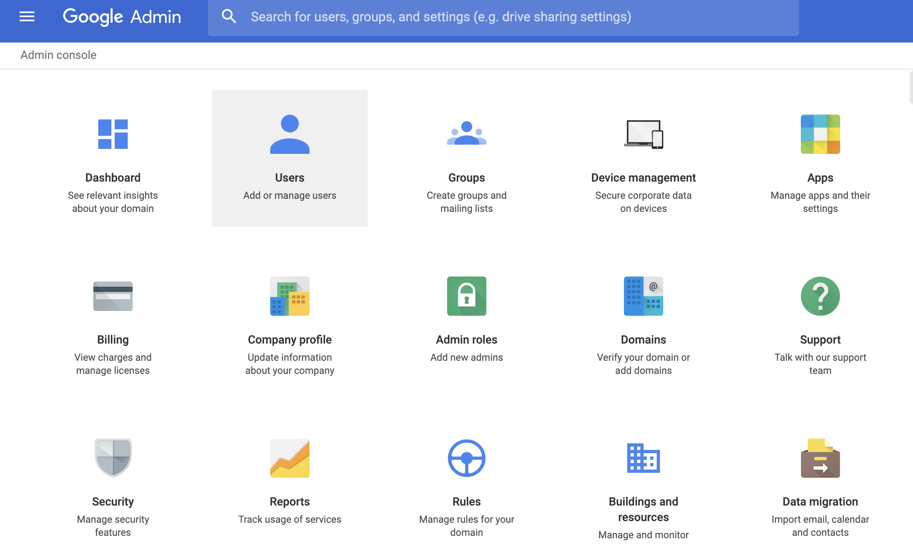
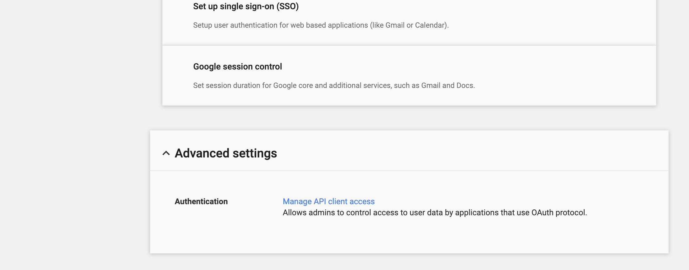

# gcp-assessment-setup
Give ScaleSec limited access to your GCP organization for a security assessment.

## Prerequisites
The following items are required for a successful setup.

- You must be an [Organization Role Admin](https://console.cloud.google.com/iam-admin/roles/details/roles<iam.organizationRoleAdmin)
- The [gcloud](https://cloud.google.com/sdk/) SDK CLI
- The `jq` CLI utility for your chosen platform

## Setup instructions

1. Open your Google Cloud [console](https://console.cloud.google.com).
2. Open Cloud Shell
3. Make sure to set your project to the project you want scanned.

```
gcloud config set project my-project-id-123
```

4. Clone this repositry and switch to its directory:

```
git clone https://github.com/ScaleSec/gcp-assessment-setup.git
cd gcp-assessment-setup/
```

5. Edit the `manage_security_assessment_role.sh` and set the organization name:

```
ORG_NAME="example.com"
```

_Note: other variables including the `ROLE_ID`, `YAML_PATH`, and `SERVICE_ACCOUNT` should not be changed._ 


6. Run the script to set permissions:

```
bash manage_security_assessment_role.sh create
```

7. Run the script to enable APIs:

```
bash enable_service_apis.sh
```

### 8. Select the Newly Created Service Account from the Service Accounts Pane to get to the `Service Account Details` and select `edit`


### 9. Select the `SHOW DOMAIN-WIDE DELEGATION` drop-down and select the checkbox for `Enable G Suite Domain-Wide Delegation`.  Click `Save`


### 10. Copy down the Client ID (This will be used in the G-Suite Admin Console)


## From the Admin Console (https://admin.google.com):

### 11. Sign into the Admin Console with a `Super User` Account:



### 12. Select Security --> Advanced Settings --> Manage API Client Access



### 13. Input the Client ID from Step 8 into the `Client Name` Field.  Add `https://www.googleapis.com/auth/admin.directory.user.readonly` to the API Scopes Field

